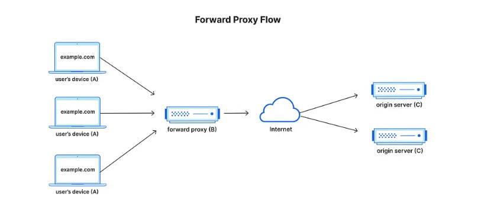

# Forward Proxy & Reverse Proxy

So bascially we have two components like server ---->client so between these we have prox so &#x20;

Forward proxy:

Forward proxy is basically setup in  the **client side**&#x20;

So when i try to access the some of the websites it is blocked right - so this will be handled by fwd proxy with the use of rules we can block these websites before reaching its respective server  and&#x20;

Another case is **vpn** is also **advanced forward proxy servers** which it is used for encryption of data which setup the tunnel and send the data in the tunnel form client to server which i form of encryption and security

Popular Forward Proxy Tools:

squid

tinyproxy

haproxy

nginx

Example: Forward Proxy

<figure><figcaption></figcaption></figure>

Reverse Proxy:

Reverse Proxy is the one which configured at server side which it can handles and implements load balancing, WAF, ssl, ratelimiting (i.e: how many hits can user make) so another if we have not configured many of the security bases reverse proxy will handles and had the features of this&#x20;

And reverse proxy and forward proxy can co exist&#x20;

Example:

<figure><figcaption></figcaption></figure>
